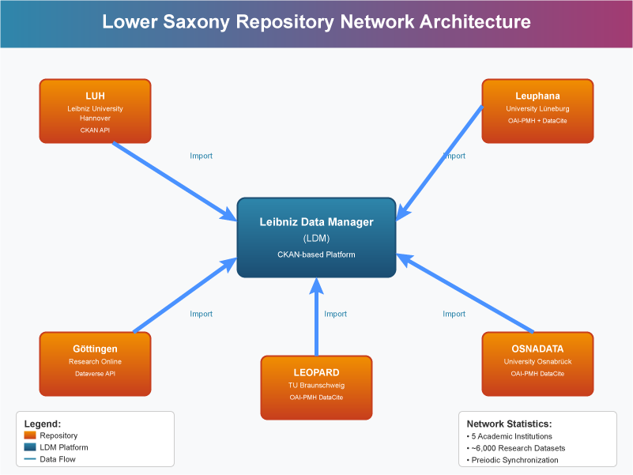
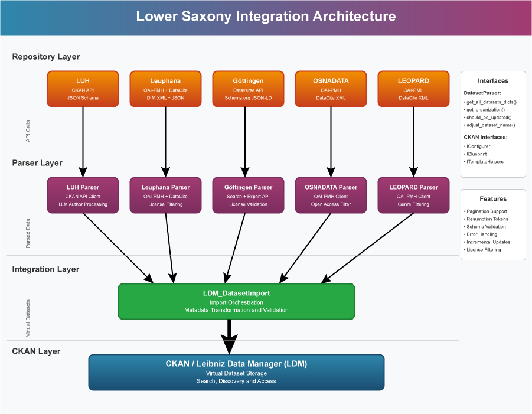

# ckanext-TIBimport – Lower Saxony Repositories System Documentation

**Version:** v1.0  
**Author:** Mauricio Brunet (mauricio.brunet@tib.eu)  
**Date:** August 15, 2025

## 1. Overview

This document provides comprehensive technical documentation for the Lower Saxony research data repositories integrated with the ckanext-TIBimport plugin. These repositories represent a collaborative network of academic institutions in Lower Saxony, Germany, working together to provide unified access to research datasets through the Leibniz Data Manager (LDM) platform.

### Lower Saxony Repository Network

The Lower Saxony repository network consists of five major academic institutions:



- **LUH (Leibniz University Hannover)** - `data.uni-hannover.de`
- **Leuphana University Lüneburg** - `pubdata.leuphana.de`
- **University of Göttingen** - `data.goettingen-research-online.de`
- **OSNADATA (University of Osnabrück)** - `osnadata.ub.uni-osnabrueck.de`
- **LEOPARD (TU Braunschweig)** - `leopard.tu-braunschweig.de`

## 2. Repository Profiles and Technical Specifications

### 2.1 LUH (Leibniz University Hannover)

**Technical Profile:**
- **API Type:** CKAN REST API
- **Endpoint:** `https://data.uni-hannover.de/api/3/action/`
- **Metadata Format:** CKAN JSON Schema
- **Dataset Prefix:** `luh-`
- **Organization:** `leibniz-university-hannover`

**Key Features:**
- Direct CKAN API integration
- Real-time metadata synchronization
- Multi-author support with LLM-based author parsing
- Comprehensive resource metadata
- Schema validation and reporting

**Data Processing Flow:**
```
CKAN API → JSON Response → Schema Validation → Author Processing → LDM Integration
```

### 2.2 Leuphana University Lüneburg

**Technical Profile:**
- **API Type:** OAI-PMH + DataCite API
- **OAI Endpoint:** `https://pubdata.leuphana.de/server/oai/request`
- **Metadata Format:** DIM (Dublin Core Extended) + DataCite JSON
- **Dataset Prefix:** `leu-`
- **Organization:** `leuphana`

**Key Features:**
- Hybrid metadata approach (OAI-PMH + DataCite)
- Open access license filtering
- Dataset type filtering (research data only)
- DOI-based metadata enrichment
- Resumption token support for large datasets

**Notice**: the metadata harvested from the OAI-PMH was not sufficient for populating the LDM metadata schema and also for filtering by license the datasets imported. The solution implemented harvest complementary metadata from DataCite using the API.

**Data Processing Flow:**
```
OAI-PMH → DIM XML → DOI Extraction → DataCite API → License Filtering → LDM Integration
```

### 2.3 University of Göttingen (GRO.data)

**Technical Profile:**
- **API Type:** Dataverse Search API + Schema.org Export
- **Search Endpoint:** `https://data.goettingen-research-online.de/api/search`
- **Export Endpoint:** `https://data.goettingen-research-online.de/api/datasets/export`
- **Metadata Format:** Schema.org JSON-LD
- **Dataset Prefix:** `goe-`
- **Organization:** `goettingen`

**Key Features:**
- Dataverse platform integration
- Schema.org structured data
- Open license validation
- Paginated dataset retrieval
- Rich metadata with keywords and descriptions

**Notice**: the metadata harvested from API was not sufficient for populating the LDM metadata schema and also for filtering by license the datasets imported. The solution implemented harvest complementary metadata from the exportation feature of the Goettingen API.

**Data Processing Flow:**
```
Search API → Dataset List → Schema.org Export → License Validation → LDM Integration
```

### 2.4 OSNADATA (University of Osnabrück)

**Technical Profile:**
- **API Type:** OAI-PMH
- **Endpoint:** `https://osnadata.ub.uni-osnabrueck.de/oai`
- **Metadata Format:** DataCite XML (oai_datacite)
- **Dataset Prefix:** `osn-`
- **Organization:** `osnadata`

**Key Features:**
- DataCite metadata standard compliance
- Open access filtering
- Dataset type validation
- Resumption token support
- Comprehensive creator information with ORCID support

**Data Processing Flow:**
```
OAI-PMH → DataCite XML → Type/License Filtering → Metadata Parsing → LDM Integration
```

### 2.5 LEOPARD (TU Braunschweig)

**Technical Profile:**
- **API Type:** OAI-PMH
- **Endpoint:** `https://leopard.tu-braunschweig.de/servlets/OAIDataProvider`
- **Metadata Format:** DataCite XML (oai_datacite)
- **Dataset Prefix:** `leo-`
- **Organization:** `leopard`
- **Set Filter:** `GENRE:research_data`

**Key Features:**
- Research data genre filtering
- DataCite 4.x schema compliance
- Rich subject area classification
- Related identifier support
- Comprehensive rights management

**Data Processing Flow:**
```
OAI-PMH → DataCite XML → Genre Filtering → Metadata Parsing → LDM Integration
```

## 3. Integration Architecture

### 3.1 System Architecture Overview



The integration architecture follows a modular approach where each repository has a dedicated parser profile that handles the specific requirements and data formats of that repository.

### 3.2 Parser Profile Architecture

Each repository implements the `DatasetParser` interface with the following key methods:

```python
class DatasetParser:
    def get_all_datasets_dicts(self):
        """Retrieve all datasets from remote repository"""
        
    def get_organization(self, name):
        """Get organization metadata"""
        
    def should_be_updated(self, local_dataset, remote_dataset):
        """Determine if dataset needs updating"""
        
    def adjust_dataset_name(self, ds_name):
        """Normalize dataset identifiers"""
```

### 3.3 Data Flow Process

The data flow process consists of several stages:

1. **Repository Harvesting:** Each parser profile connects to its respective repository API
2. **Metadata Extraction:** Raw metadata is extracted in the repository's native format
3. **Format Conversion:** Metadata is converted to a standardized internal format
4. **Validation & Filtering:** Data quality checks and filtering (open access, dataset type)
5. **LDM Integration:** Converted metadata is integrated into the CKAN-based LDM system

## 4. Metadata Mapping and Standardization

### 4.1 Common Metadata Schema

All repositories are mapped to a common LDM virtual dataset schema:

```json
{
  "type": "vdataset",
  "repository_name": "Repository Name",
  "name": "prefix-identifier",
  "title": "Dataset Title",
  "author": "Last, First",
  "doi": "10.xxxx/xxxxx",
  "url": "https://repository.url/dataset",
  "license_id": "license-identifier",
  "license_title": "License Name",
  "notes": "Dataset description",
  "tags": [...],
  "subject_areas": [...],
  "organization": {...},
  "publishers": [...],
  "publication_year": "YYYY"
}
```

### 4.2 Repository-Specific Mappings

#### LUH Mapping
- **Source:** CKAN JSON → **Target:** LDM Schema
- **Special Processing:** Multi-author parsing using LLM
- **Unique Fields:** `terms_of_usage`, `have_copyright`

#### Leuphana Mapping
- **Source:** DIM XML + DataCite JSON → **Target:** LDM Schema
- **Special Processing:** DOI-based metadata enrichment
- **Unique Fields:** License validation through DataCite

#### Göttingen Mapping
- **Source:** Schema.org JSON-LD → **Target:** LDM Schema
- **Special Processing:** Open license validation
- **Unique Fields:** Rich keyword extraction

#### OSNADATA Mapping
- **Source:** DataCite XML → **Target:** LDM Schema
- **Special Processing:** Open access filtering
- **Unique Fields:** ORCID identifier support

#### LEOPARD Mapping
- **Source:** DataCite XML → **Target:** LDM Schema
- **Special Processing:** Research data genre filtering
- **Unique Fields:** Related identifier relationships

## 5. Configuration and Deployment

### 5.1 CKAN Configuration

Add the following to your CKAN configuration file (`/etc/ckan/default/ckan.ini`):

```ini
# Enable TIBimport plugin
ckan.plugins = ... tibimport

# Configure automatic updates
tibimport.updatedatasets_enabled = true
tibimport.updatedatasets_crontab_user = ckan

# Set log file path
tibimport.log_file_path = /var/log/ckan/tibimport/
```

### 5.2 Repository-Specific Import Commands

Each repository can be imported individually using specific commands:

```bash
# Import LUH datasets
curl -X POST "http://localhost:5000/import_vdatasets_luh"

# Import Leuphana datasets
curl -X POST "http://localhost:5000/import_vdatasets_leuphana"

# Import Göttingen datasets
curl -X POST "http://localhost:5000/import_vdatasets_goettingen"

# Import OSNADATA datasets
curl -X POST "http://localhost:5000/import_vdatasets_osnadata"

# Import LEOPARD datasets
curl -X POST "http://localhost:5000/import_vdatasets_leopard"
```

### 5.3 Automated Synchronization

The system supports automated synchronization through cron jobs:

```bash
# Add to crontab for daily synchronization
0 2 * * * /usr/lib/ckan/default/bin/python /usr/lib/ckan/default/src/ckanext-TIBimport/ckanext/tibimport/run_importation_update.py
```


## 6. Error Handling and Monitoring


### 6.1 Monitoring and Logging

Each repository parser generates detailed logs:

```
[INFO] LUH_2025-08-13_10:00:00: Starting dataset import
[INFO] LUH_2025-08-13_10:01:15: Found 1,847 datasets
[INFO] LUH_2025-08-13_10:15:30: Import completed successfully
[ERROR] LEU_2025-08-13_10:30:45: DataCite API timeout for DOI 10.xxxx/xxxxx
[WARN] GOE_2025-08-13_11:00:00: Invalid license detected, skipping dataset
```

## 7. Appendices

### 7.1 API Endpoints Reference

| Repository | Type | Endpoint | Documentation |
|------------|------|----------|---------------|
| LUH | CKAN API | `/api/3/action/` | [CKAN API Guide](https://docs.ckan.org/en/2.9/api/) |
| Leuphana | OAI-PMH | `/server/oai/request` | [OAI-PMH Protocol](https://www.openarchives.org/OAI/openarchivesprotocol.html) |
| Göttingen | Dataverse | `/api/search` | [Dataverse API Guide](https://guides.dataverse.org/en/latest/api/) |
| OSNADATA | OAI-PMH | `/oai` | [OAI-PMH Protocol](https://www.openarchives.org/OAI/openarchivesprotocol.html) |
| LEOPARD | OAI-PMH | `/servlets/OAIDataProvider` | [OAI-PMH Protocol](https://www.openarchives.org/OAI/openarchivesprotocol.html) |

### 7.2 Metadata Schema Mappings

Detailed field-by-field mappings for each repository are available in the respective parser profile source code files:

- `LUH_CKAN_API_ParserProfile.py`
- `LEUPHANA_ParserProfile.py`
- `GOETTINGEN_ParserProfile.py`
- `OSNADATA_ParserProfile.py`
- `LEOPARD_ParserProfile.py`


---
