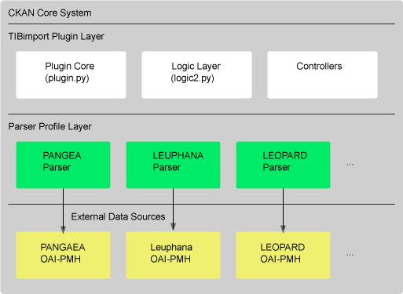
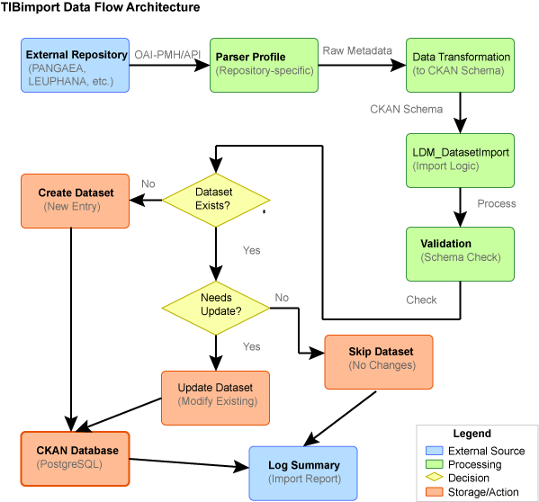
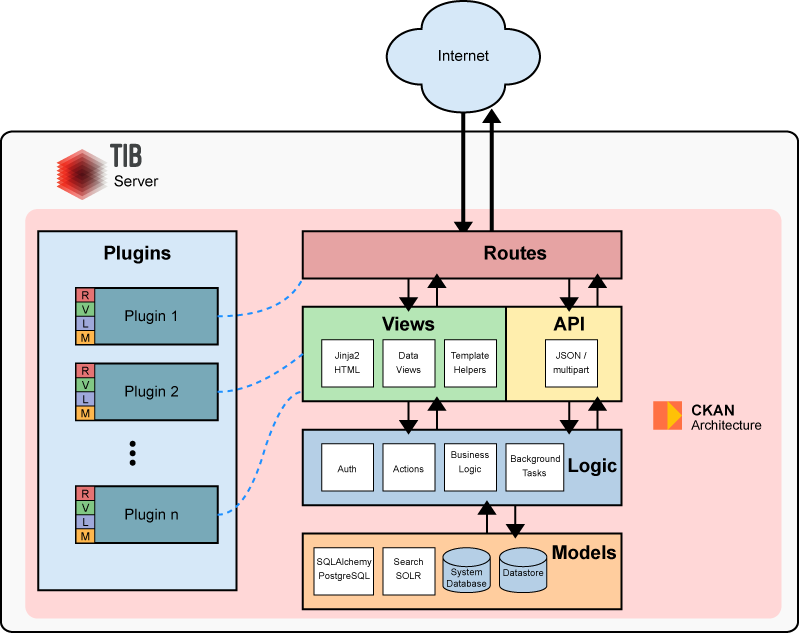
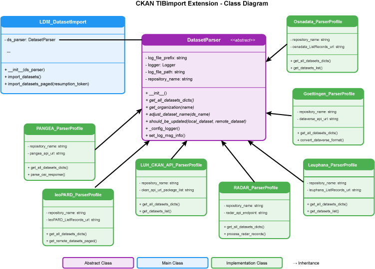
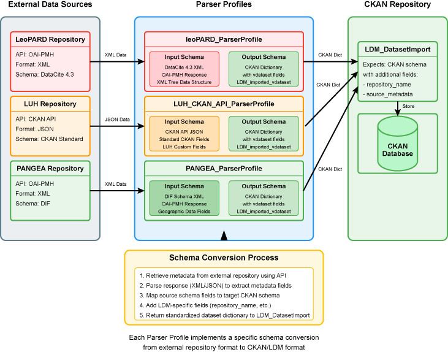
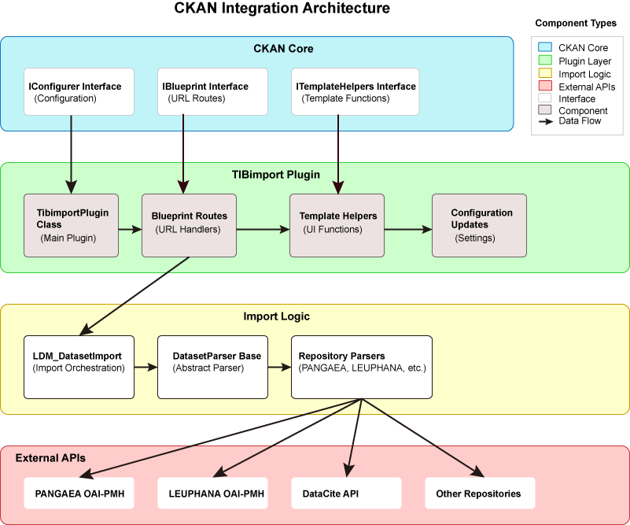

# ckanext-TIBimport – System Documentation

**Version:** v1.0  
**Author:** Mauricio Brunet (mauricio.brunet@tib.eu)  
**Date:** August 15, 2025

## 1. Technical Overview

### Purpose
The ckanext-TIBimport plugin is a comprehensive CKAN extension designed to import and synchronize research datasets from multiple external data repositories into a centralized CKAN instance. The plugin enables automated harvesting, transformation, and integration of metadata from various scientific data sources, creating "virtual datasets" that maintain links to their original sources while providing unified access through CKAN's interface.

### Architecture

Integration of the TIBimport plugin with CKAN:




**Key Components:**
- **Plugin Core**: Main plugin class implementing CKAN interfaces
- **Logic Layer**: Dataset import/update orchestration and CKAN API interaction
- **Parser Profiles**: Repository-specific metadata parsers and transformers
- **Background Jobs**: Automated scheduling and execution system
- **Template System**: Custom UI components for import results

## 2. System Requirements

### Hardware
- **Minimum**: 2 CPU cores, 4GB RAM, 10GB storage
- **Recommended**: 4+ CPU cores, 8GB+ RAM, 50GB+ storage
- **Network**: Stable internet connection for external API access

### Software
- **Operating System**: Linux (Ubuntu 18.04+ recommended)
- **Python**: 3.7+
- **CKAN**: 2.9+
- **Database**: PostgreSQL 10+
- **Web Server**: Apache/Nginx
- **Additional Dependencies**:
  - `requests` - HTTP client library
  - `xmltodict` - XML parsing
  - `python-crontab` - Cron job management
  - `lxml` - XML processing

## 3. Installation Details

### Deployment Methods

#### Standard Installation
```bash
# 1. Activate CKAN virtual environment
. /usr/lib/ckan/default/bin/activate

# 2. Install the extension
pip install ckanext-TIBimport

# 3. Add to CKAN configuration
echo "ckan.plugins = ... tibimport" >> /etc/ckan/default/ckan.ini

# 4. Restart CKAN
sudo service apache2 reload
```

#### Development Installation
```bash
# 1. Copy the plugin folder into ckan's source folder (normally /usr/lib/ckan/default/src) and later cd to that folder
cd /usr/lib/ckan/defaul/src/ckanext-TIBimport

# 2. Install in development mode
python setup.py develop
pip install -r dev-requirements.txt
```

### Configuration Files

#### Primary Configuration (`/etc/ckan/default/ckan.ini`)
```ini
# Plugin activation
ckan.plugins = ... tibimport

# Log file path (optional)
tibimport.log_file_path = /var/log/ckan/tibimport/

# Config automatic updates
tibimport.updatedatasets_enabled = true
tibimport.updatedatasets_crontab_user = ckan

# PANGAEA resumption token recovery (optional)
# When this feature is set to "true" the PANGAEA importation continues from the token provided (This token can be found in the logs after a interruption of the importation)
force_resumption_token_pangaea = false
resumption_token_pangaea = ""
```

#### Directory Structure
```
/usr/lib/ckan/default/src/ckanext-TIBimport/
├── ckanext/
│   └── tibimport/
│       ├── plugin.py              # Main plugin class
│       ├── logic2.py              # Import orchestration
│       ├── controllers.py         # Web controllers
│       ├── *_ParserProfile.py     # Repository parsers
│       ├── templates/             # UI templates
│       ├── public/               # Static assets
│       └── tests/                # Test suite
```

## 4. Functional Specifications

### Core Features

#### 1. Multi-Repository Data Import
- **Supported Repositories**:
  - PANGAEA (Earth & Environmental Science)
  - LEUPHANA (University Repository)
  - LEOPARD (TU Braunschweig)
  - RADAR (Research Data Repository)
  - OSNADATA (Open Science Data)
  - GOETTINGEN (University Repository)
  - LUH (Leibniz University Hannover)

#### 2. Parser Profile System
Each repository has a dedicated parser profile implementing the `DatasetParser` interface:

```python
class DatasetParser:
    def get_all_datasets_dicts(self):
        """Retrieve all datasets from remote repository"""
        pass
    
    def get_organization(self, name):
        """Get organization metadata"""
        pass
    
    def should_be_updated(self, local_dataset, remote_dataset):
        """Determine if dataset needs updating"""
        pass
    
    def adjust_dataset_name(self, ds_name):
        """Normalize dataset identifiers"""
        pass
```

#### 3. Virtual Dataset Management
- Creates "vdataset" type entries in CKAN
- Maintains links to original sources
- Preserves source metadata timestamps
- Handles DOI resolution and validation

#### 4. Automated Synchronization
- Cron-based scheduling system
- Configurable update frequencies per repository
- Background job queue integration
- Error handling and recovery mechanisms

### User Roles and Permissions
- **System Administrator**: Full access to import functions and configuration
- **Regular Users**: Read-only access to imported datasets
- **API Users**: Programmatic access through CKAN API

## 5. Data Handling

### Input/Output Data Types

#### Input Formats
- **OAI-PMH XML**: Primary harvesting protocol
- **JSON-LD**: Structured metadata format
- **DataCite XML**: DOI metadata standard
- **Dublin Core**: Basic metadata schema

#### Output Format
All imported data is transformed into CKAN's internal dataset schema:

```json
{
  "type": "vdataset",
  "name": "repository-prefix-dataset-id",
  "title": "Dataset Title",
  "repository_name": "Source Repository",
  "doi": "10.1234/example.doi",
  "url": "https://source.repository/dataset/id",
  "author": "Last, First",
  "organization": {
    "name": "repository-org",
    "title": "Repository Organization"
  },
  "tags": [...],
  "subject_areas": [...],
  "related_identifiers": [...]
}
```

### Data Flow Architecture



The diagram illustrates the complete data flow process from external repositories through to CKAN database storage:

1. **External Repository**: Source repositories (PANGAEA, LEUPHANA, etc.) provide data via OAI-PMH or API endpoints
2. **Parser Profile**: Repository-specific parsers extract and normalize metadata
3. **Data Transformation**: Raw metadata is converted to CKAN's standard schema format
4. **LDM_DatasetImport**: Import orchestration logic handles the processing workflow
5. **Validation**: Schema validation and data quality checks are performed
6. **Decision Logic**: The system determines whether datasets are new, need updates, or should be skipped
7. **Database Operations**: New datasets are created, existing ones updated, or processing skipped as appropriate
8. **Logging**: All operations are logged with detailed summaries for monitoring and debugging

### Integration in LDM (Leibniz Data Manager)

The Leibniz Data Manager (LDM) is an adaptive research data management system that leverages FAIR principles and Semantic Web technologies to help researchers document, analyze, and share research datasets.
Base Architecture (CKAN-based). The system extends CKAN with additional features through CKAN extensions to provide enhanced research data management capabilities.



Class diagram:



Metadata conversion flow:



## 6. Security Considerations

### Authentication
- Leverages CKAN's built-in authentication system
- Admin-only access to import functions
- API key-based programmatic access

### Data Protection
- **Input Validation**: All external data sanitized before processing
- **SQL Injection Prevention**: Uses CKAN's ORM for database operations
- **Access Control**: Repository-specific permission checks


## 7. Performance Metrics


### Optimization Strategies
- **Pagination**: Processes datasets in configurable batches
- **Caching**: Stores organization metadata to reduce API calls
- **Incremental Updates**: Only processes changed datasets

## 8. Assumptions

### Preconditions (Natural Language)
- CKAN instance is properly installed and configured
- External repositories maintain stable API endpoints
- Network connectivity allows outbound HTTPS connections
- Sufficient disk space available for logs and temporary files
- PostgreSQL database has adequate connection limits
- System user has appropriate file system permissions

### Postconditions (Natural Language)
- Virtual datasets are created with proper CKAN schema compliance
- Source repository links remain accessible and valid
- Import logs are generated with detailed operation summaries
- Organizations are created/updated to reflect repository structure
- Background jobs are scheduled for automated synchronization
- Error conditions are logged with sufficient detail for debugging

## 9. Plugin Architecture

### CKAN Integration Diagram

The system follows a modular, plugin-based architecture built on CKAN's extension framework:
[]

The architecture diagram shows the hierarchical integration of the TIBimport plugin with CKAN's core system:

#### CKAN Core Layer
- **IConfigurer Interface**: Handles plugin configuration, template directories, and static resources
- **IBlueprint Interface**: Manages URL routing and web request handling
- **ITemplateHelpers Interface**: Provides custom template functions for the UI

#### TIBimport Plugin Layer
- **TibimportPlugin Class**: Main plugin class that implements CKAN interfaces
- **Blueprint Routes**: URL handlers for import operations and background job management
- **Template Helpers**: Custom functions for displaying virtual dataset information
- **Configuration Updates**: Plugin-specific settings and customizations

#### Import Logic Layer
- **LDM_DatasetImport**: Orchestrates the import process and manages CKAN API interactions
- **DatasetParser Base**: Abstract base class defining the parser interface
- **Repository Parsers**: Concrete implementations for each supported repository

#### External APIs Layer
- **PANGAEA OAI-PMH**: Earth and environmental science data repository
- **LEUPHANA OAI-PMH**: University repository with DataCite integration
- **DataCite API**: DOI metadata resolution and validation
- **Other Repositories**: RADAR, LEOPARD, OSNADATA, GOETTINGEN, and LUH

### Component Interactions

#### Plugin Registration
```python
entry_points='''
    [ckan.plugins]
    tibimport=ckanext.tibimport.plugin:TibimportPlugin
'''
```

#### Interface Implementations
- **IConfigurer**: Adds templates, static files, and admin configuration
- **IBlueprint**: Registers URL routes for import operations
- **ITemplateHelpers**: Provides template functions for UI customization

#### URL Routes
```python
routes = [
    ('/import_vdatasets_luh', 'import_vdatasets_luh', import_vdatasets_luh),
    ('/import_vdatasets_png/<_type>', 'import_vdatasets_png_topic', import_vdatasets_png),
    ('/tib_add_imported_datasets_update/<_type>', 'tib_importation_update', add_imported_datasets_update),
]
```

## 10. Maintenance and Support

### Events Requiring Updates

#### Input Condition Changes
- **New Repository Integration**: When additional data sources need to be supported
- **API Schema Changes**: When external repositories modify their metadata formats
- **Authentication Updates**: When repositories change access requirements
- **Data Quality Issues**: When imported datasets contain invalid or malformed metadata

#### Precondition Violations
- **CKAN Version Incompatibility**: When CKAN core updates break plugin interfaces
- **Database Schema Changes**: When CKAN's dataset schema is modified
- **Python Dependency Updates**: When required libraries introduce breaking changes
- **Network Policy Changes**: When firewall rules block repository access

### Support Channels
- **Primary Contact**: mauricio.brunet@tib.eu
- **Repository Issues**: https://github.com/Rmbruno11/ckanext-TIBimport/issues
- **CKAN Community**: https://github.com/ckan/ckan/discussions
- **Documentation**: Plugin README and inline code comments

## 11. Appendices

### Change Log

#### Version 0.0.1 (Current)
- Initial release with support for 7 repositories
- Basic OAI-PMH harvesting functionality
- Virtual dataset creation and management
- Automated background job scheduling
- Template customization for import results

### Known Issues

#### Current Limitations
- **Large Dataset Handling**: Memory usage can be high for repositories with >10,000 datasets
- **Error Recovery**: Limited automatic retry mechanisms for failed imports
- **Metadata Validation**: Basic validation only, may accept malformed data


