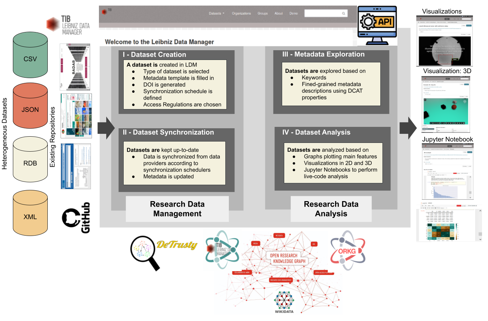

# The Leibniz Data Manager (LDM)

The Leibniz Data Manager (LDM) is an open source and free web-based application for Research Data Management (RDM). LDM delivers different distributions to best fit the specific requirements of various customers, e.g., institutes and research groups performing RDM in various scientific disciplines. The LDM distributions are designed, maintained, and curated by  TIB  and  L3S.

The prototype currently offers the following functions for the visualization of research data:

Supports data collections and publications  with different formats
Different views on the same data set (2D and 3D support)
Visualization of Auto CAD files
Jupyter Notes for demonstrating live code
RDF Description of data collections
The file specific viewers were implemented using CKAN (Comprehensive Knowledge Archive Network) plugins to render existing viewers for the datasets included in the CKAN instance.

The RDM arelated concepts, the LDM distributions, and the deployment methods are explained in the projects wiki on GitHub.

Besides the Leibniz Data Manager, TIB provides further services around research data management for institutions and researchers. This includes a DOI service, support in choosing the right repositories, and in publishing and archiving research data, as well as training and advisory services. Please refer to our homepage for a full service description: https://www.tib.eu/en/publishing-archiving/research-data/

More info about the LDM project can be found on the TIB webpage and the last updated code in the GitHub repository.

Please, contact us at service.ldm@tib.eu if you have comments or questions.

# LDM Features

## Wikidata Explorer Feature
With this feature the user is able to extend CSV datasets with existing information in the Wikidata KG. The tool applies entity linking to all concepts in the same column and enable the user to use the extracted entities to extend the dataset. Here below is a demo video of how the tool works:

<iframe width="560" height="315" src="[https://www.youtube.com/embed/dQw4w9WgXcQ](https://service.tib.eu/ldmservice/dataset/66e93a29-1dc3-48a3-9611-02c29e221cec/resource/fa0b0487-fee8-43f6-a7bc-23657e8e5f53/download/ldm-falcon.mp4)" frameborder="0" allow="accelerometer; autoplay; clipboard-write; encrypted-media; gyroscope; picture-in-picture" allowfullscreen></iframe>
